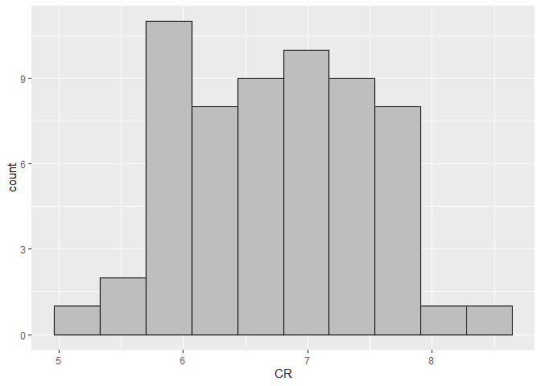
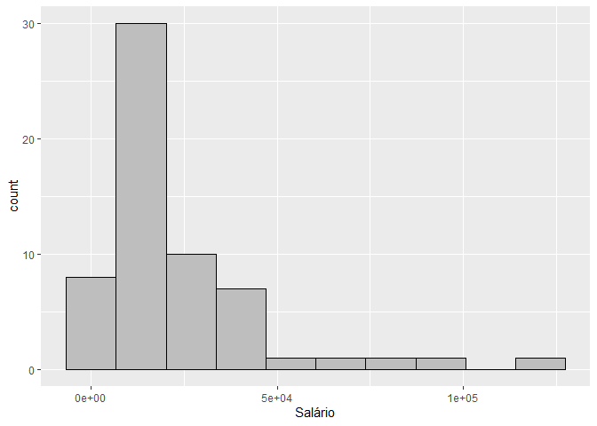

<!-- README.md is generated from README.Rmd. Please edit that file -->

# louzada-spearman-correlation

``` r
library(tidyverse)
#> -- Attaching packages --------------------------------------- tidyverse 1.3.2 --
#> v ggplot2 3.3.6     v purrr   0.3.4
#> v tibble  3.1.8     v dplyr   1.0.9
#> v tidyr   1.2.0     v stringr 1.4.0
#> v readr   2.1.2     v forcats 0.5.1
#> -- Conflicts ------------------------------------------ tidyverse_conflicts() --
#> x dplyr::filter() masks stats::filter()
#> x dplyr::lag()    masks stats::lag()
dados <- readxl::read_excel("data/Correlação Entre CR , Cargo , Salário.xlsx")
glimpse(dados)
#> Rows: 60
#> Columns: 4
#> $ Nome    <chr> "Adriana Sampaio Costa de Souza", "Aguinaldo Castaldelli Neto"~
#> $ CR      <dbl> 7.68, 6.78, 7.59, 7.49, 6.98, 6.16, 6.30, 5.74, 6.89, 7.30, 7.~
#> $ Cargo   <chr> "Gerencia", "Gerencia", "Supervisão", "Operacional", "Gerencia~
#> $ Salário <dbl> 37000, 40000, 14000, 5000, 45800, 80000, 11000, 13000, 17500, ~
```

## Teste de Pressuposições (normalidade)

### Histograma CR

``` r
dados %>% 
  ggplot(aes(x=CR))+
  geom_histogram(bins=10, color="black", fill="gray")
```

<!-- -->

``` r
dados %>% pull(CR) %>% shapiro.test()
#> 
#>  Shapiro-Wilk normality test
#> 
#> data:  .
#> W = 0.97661, p-value = 0.3023
```

- Distribuição normal para os CRs.

### Histograma Salário

``` r
dados %>% 
  ggplot(aes(x=Salário))+
  geom_histogram(bins=10, color="black", fill="gray")
```

<!-- -->

``` r
dados %>% pull(Salário) %>% shapiro.test()
#> 
#>  Shapiro-Wilk normality test
#> 
#> data:  .
#> W = 0.7215, p-value = 2.357e-09
```

- Distribuição assimétrica não normal para Salário.

Devido à falta de normalidade, foi utilizada a correlação de Spearman.

## Correlação de Spearman

``` r
cor(dados %>% select(CR, Salário), method = "spearman")
#>                CR   Salário
#> CR      1.0000000 0.1421561
#> Salário 0.1421561 1.0000000
```

Foi observado que o coeficiente de correlação de postos de Spearman
entre Salário e CR foi de
,
ou seja, foi maior que

e menor que
,
indicando uma correlação positiva moderada entre as duas variáveis. Isso
significa que, à medida que uma variável aumenta, a outra também
aumenta, mas não de forma proporcional.
